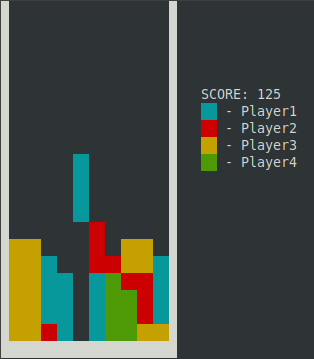

# **Tetris Online January 2023**
### Terminal-based Tetris game with ncurses-backed rendering subsystem  and multiplayer capabilities. 

</img>
## Build Requirements

| Tool/Dependency | Installation |
|---|---|
|GCC + Make | `apt install build-essential` |
|ncurses library | `apt-get install libncurses5-dev libncursesw5-dev` |

## Build
Use `build.sh` to build project binaries. 
**Note:** It is highly recommended to run `build.sh` from the root directory of the project.

## User Guide & Controls
File `config.cfg` contains user-defined port. Make use of it if you'd like to define your own port. 
If program fails to read `config.cfg` port **7070** is utilized by default.

| Key | Action |
|---|---|
|Arrow Up | Rotate shape / Menu navigate up |
|Arrow Down | Move shape down / Menu navigate down |
|Arrow Left |  Move shape to the left |
|Arrow Right | Move shape to the right |
|Esc | Exit game |

## Project Structure
| Module | Description | Depends On |
|---|---|---|
|client.c | Thin client. Sends user input to the server, receives ready-to-draw game field. | net.c, util.c |
|server.c | Puts networking and game logic together. Processes client data. | net.c, game.c, util.c |
|game.c | Provides server.c with essential Tetris logic. | util.c |
|net.c | Wrapper over Linux networking API, intended to bring uniformity to the project's netcode. | util.c |
|util.c | Implements utility procedures like logging, time, paths etc. | |